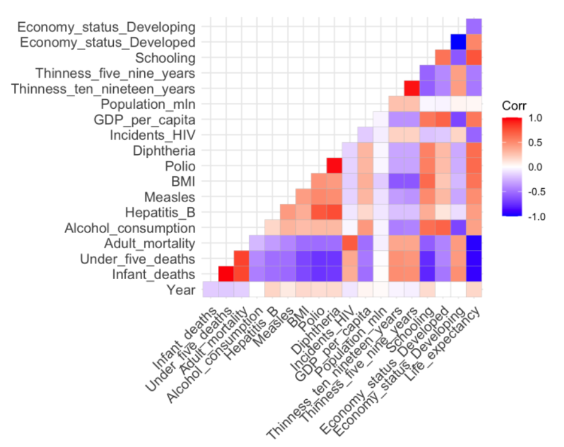
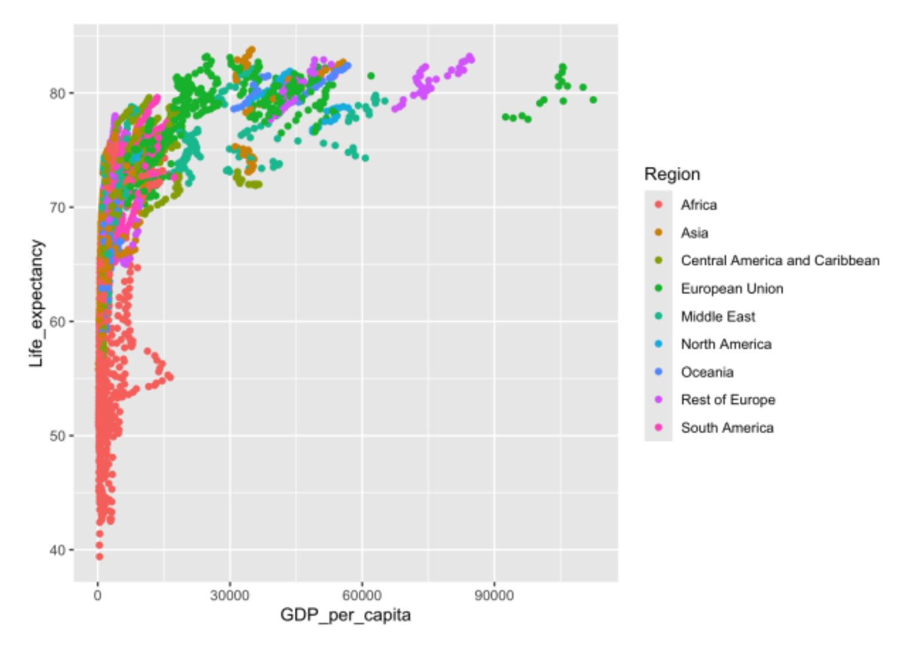
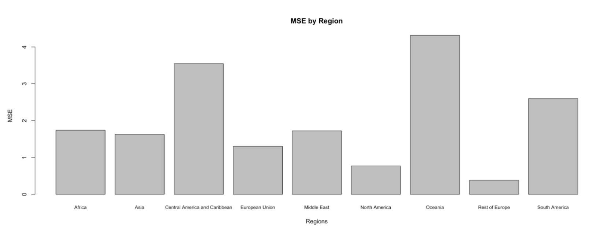
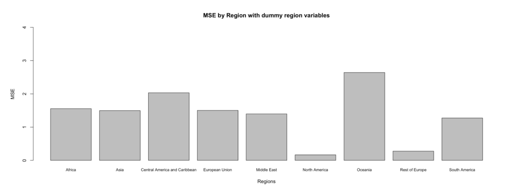
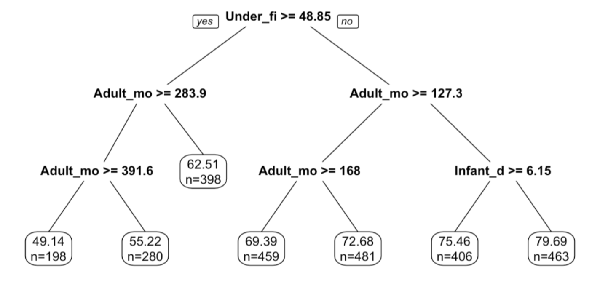

# Predicting Life Expectancy from Socio-Economic and Health Indicators

Predicting national life expectancy for 179 countries using 15 years of health, mortality, immunization, economic and demographic data. Compares linear regression, regression trees, neural networks and XGBoost.

**Headline result:** XGBoost predicted 2015 life expectancy to within about 0.6 years on average (out-of-sample MSE 0.3631), roughly four times more accurate than the best linear model. Adding region information to linear regression cut its error by 23%, with almost all of the gain concentrated in the regions that had been predicted worst.

**[Full report (PDF)](report/Final_Report.pdf)** with all figures, the variable selection detail, and references for every data source.

---

## Problem

Life expectancy drives real policy decisions. Governments use it to evaluate public health programs and to size pension and social security obligations, where the funding model depends directly on how long people are expected to live.

Two goals:

1. Predict a country's life expectancy from its health, economic and demographic indicators.
2. Identify which factors contribute most to low life expectancy.

## Data

2,864 rows covering 179 countries from 2000 to 2015, with 20 independent variables and life expectancy as the target. Compiled from WHO, World Bank and University of Oxford sources.

Variables span mortality (infant deaths, under-five deaths, adult mortality), immunization coverage (hepatitis B, measles, polio, diphtheria), health and lifestyle (BMI, alcohol consumption, HIV incidence, thinness prevalence), and socio-economic indicators (GDP per capita, population, schooling, developed/developing status, region).

Source: [Life Expectancy (WHO) Updated](https://www.kaggle.com/datasets/lashagoch/life-expectancy-who-updated/data) on Kaggle. Full per-indicator references are in the report.

**Split.** Training is 2000–2014 (2,685 rows), test is 2015 (179 rows). The split is temporal rather than random because the practical use case is predicting forward from history, and a random split would let the model see a country's neighbouring years while predicting the year in between.

## Exploratory findings

- 20% of countries are classified as developed, 80% as developing.
- Life expectancy spans 39.4 to 83.8 years, mean 68.86.
- Every numeric variable except Year contains outliers. HIV incidence, population, and GDP per capita are severely right-skewed, with the large majority of countries in the lowest bucket and a long thin tail.

**Correlation structure.** Mortality variables correlate strongly negatively with life expectancy, as expected. Developed status correlates positively. Immunization coverage moves with life expectancy across the board. The more interesting one is schooling, which shows a moderate positive correlation despite having no direct causal path to lifespan, and which stayed in the model through every variable selection round.

**GDP shows sharp diminishing returns.** Plotting life expectancy against GDP per capita by region, the curve rises steeply at low income levels in Africa and South America and then flattens. Beyond a certain point, additional GDP per capita buys very little additional lifespan. This is the clearest argument in the analysis for why a purely economic model would be inadequate.

**Schooling behaves differently by region.** The positive relationship between years of education and life expectancy holds firmly in most regions but is noticeably less consistent in Asia and Africa, which was the first signal that region-specific effects mattered.

## Results

| Model | Details | Adj. R² | In-sample MSE | Out-of-sample MSE |
|---|---|---|---|---|
| Linear regression | No region info | 0.9795 | 1.8234 | 1.9320 |
| Linear regression | Region dummies | 0.9841 | 1.4127 | **1.4946** |
| Linear regression | Region dummies, AIC selection (22 vars) | 0.9841 | 1.4142 | 1.5021 |
| Linear regression | Region dummies, BIC selection (14 vars) | 0.9840 | 1.4283 | 1.5105 |
| Regression tree | All variables | — | 6.2662 | 7.3424 |
| Neural network | 1 hidden layer, 3 neurons | — | 0.8102 | 10.7218 |
| Neural network | 1 hidden layer, 5 neurons | — | 0.5742 | 12.7334 |
| XGBoost | 100 rounds, squared error loss | — | 0.0121 | **0.3631** |

XGBoost predicts within roughly 0.60 years on average, against 1.22 years for the best linear model and 2.71 years for the regression tree.

### Region information was the single biggest improvement to the linear model

The baseline linear regression already performed well, but breaking its error down by region showed the accuracy was not evenly distributed. Central America and the Caribbean, Oceania, and South America had error two to five times higher than North America or the rest of Europe.

Two things explain it: those regions have fewer countries and are therefore underrepresented, and their life expectancy patterns differ enough that a single global relationship does not fit them.

Adding eight dummy variables for the nine regions brought the model to 26 independent variables, lifted adjusted R² from 0.9795 to 0.9841, and cut out-of-sample MSE from 1.9320 to 1.4946. The improvement landed almost entirely on the three regions that had been worst.

MSE by Region Before:

MSE by Region After:

### Variable selection improved interpretability at a small accuracy cost

Backward elimination minimizing AIC produced a 22-variable model, dropping alcohol consumption, measles immunization, population, and developing-economy status. Measles and developing status are unsurprising, since both are largely captured by correlated variables already in the model. Population and alcohol consumption being dropped is more interesting, since both are commonly assumed to matter.

BIC selection was more aggressive, retaining 14 variables: four region dummies (Central America and Caribbean, European Union, Oceania, South America), year, the three mortality measures, hepatitis B, BMI, HIV incidence, GDP per capita, schooling, and developed status. That list is a reasonable answer to the second project goal, which was identifying what actually drives life expectancy.

Neither selected model beat the full one on out-of-sample MSE (1.5021 and 1.5105 against 1.4946). The tradeoff is a small accuracy loss for a substantially smaller and more explainable model, which for a policy audience is usually the right trade.

### Why the other methods failed

**The regression tree was too simple.** At 7.3424 out-of-sample MSE it was the worst model tested. Looking at the fitted tree explains why: every split is on a mortality variable (under-five deaths, adult mortality, infant deaths) and nothing else enters the model at all. It reduces to a coarse lookup table on mortality rates and discards the immunization, economic and education signal entirely.

**The neural networks overfit.** The 3-neuron model reached 0.8102 in-sample and 10.7218 out-of-sample. Widening to 5 neurons drove in-sample down to 0.5742 and out-of-sample up to 12.7334, which is the textbook signature of memorizing noise. With 2,685 training rows, there is not enough data to support that parameter count.

**XGBoost won.** 100 rounds of boosting on shallow trees reached 0.3631 out-of-sample, better than everything else by a factor of four. The ensemble captures the non-linearity that linear regression misses (the GDP saturation curve in particular). Worth noting that XGBoost's own in-sample-to-out-of-sample ratio is larger than the neural networks'. However, what makes it the right choice is not that it avoids fitting the training data tightly but that its absolute error on unseen data is the lowest. 

## Limitations

**The baseline R² is inflated by construction.** Infant deaths, under-five deaths and adult mortality are inputs to the life tables from which life expectancy is derived. Regressing life expectancy on mortality rates is close to recovering a definition, which is why adjusted R² sits at 0.98 and why the regression tree found nothing else worth splitting on. The genuinely informative result is not the overall fit but which non-mortality variables survive selection: schooling, GDP per capita, BMI, hepatitis B coverage and HIV incidence all remain after BIC elimination, and those carry real signal. It would be interesting to explore how well the remaining socio-economic indicators predict on their own.

**Country identity is unused.** Country was dropped early to avoid countries appearing in test but not training under a random split. Under the temporal split finally adopted, every country appears in both, so that reason no longer applies. Country fixed effects would probably improve accuracy substantially and are the most obvious unexplored extension.

**Skewness is untreated.** GDP per capita, population and HIV incidence are all severely right-skewed and were fed to the linear models untransformed. A log transform on GDP in particular would likely have improved the linear fit, given the saturating relationship visible in the data.

Written in R. Requires `rpart`, `neuralnet`, `xgboost`, `ggplot2`, and `corrplot`.
